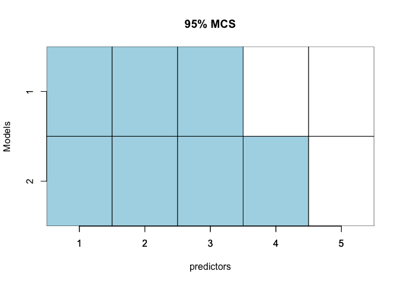
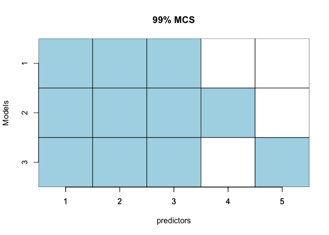

<!-- README.md is generated from README.Rmd. Please edit that file -->
# maclogp: Measures of Uncertainty for Model Selection

<!-- badges: start -->
<!-- badges: end -->
The goal of maclogp is to compute measures of uncertainty for a model selection method based on an information criterion. Two measures were proposed by [Liu, et.al](https://doi.org/10.1007/s11749-020-00737-9). The first measure is a kind of model confidence set that measures the variation of model selection, called MAC. The second measure focuses on error of model selection, called LogP. Another similar model confidence set adapted from Bayesian Model Averaging can also be computed using this package.

## Installation

You can install the released version of maclogp from github with:

``` r
devtools::install_github("YuanyuanLi96/maclogp")
```


## Example

This is a basic example which shows you how to solve a common problem:

``` r
library(maclogp)
set.seed(0)
n= 100
B=100
p=5
x = matrix(rnorm(n*p, mean=0, sd=1), n, p)
true_b = c(1:3, rep(0,p-3))
y = x%*% true_b+rnorm(n)
alpha=c(0.1,0.05,0.01)
data=list(x=x,y=y)
models=Models_gen(1:p)
result=MAC(models, data, B, alpha)#default selection criterion is "BIC".
plot_MAC(models, alpha, result$con_sets, p)
```



    #> [[1]]
    #>      [,1] [,2] [,3]  [,4]  [,5]
    #> [1,] TRUE TRUE TRUE FALSE FALSE
    #> 
    #> [[2]]
    #>      [,1] [,2] [,3]  [,4]  [,5]
    #> [1,] TRUE TRUE TRUE FALSE FALSE
    #> [2,] TRUE TRUE TRUE  TRUE FALSE
    #> 
    #> [[3]]
    #>      [,1] [,2] [,3]  [,4]  [,5]
    #> [1,] TRUE TRUE TRUE FALSE FALSE
    #> [2,] TRUE TRUE TRUE  TRUE FALSE
    #> [3,] TRUE TRUE TRUE FALSE  TRUE
    
    
 ## References
 Liu, X., Li, Y. & Jiang, J. Simple measures of uncertainty for model selection. *TEST* (2020). https://doi.org/10.1007/s11749-020-00737-9.
